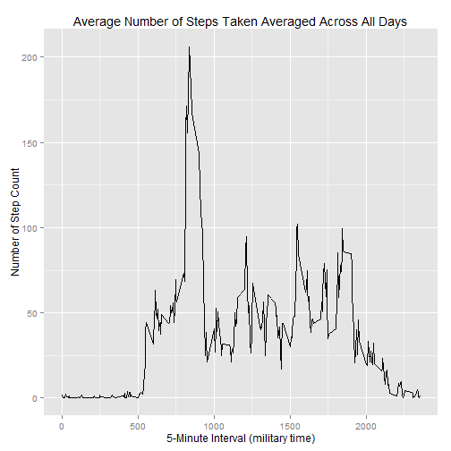
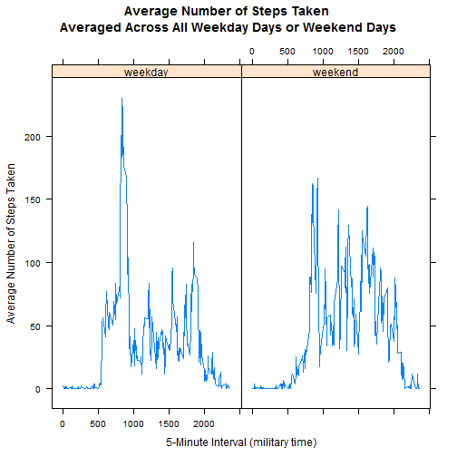

Loading and preprocessing the data

==================================================

Load input data from the downloaded zip file from the current R working directory.


```r
data <- read.table(unz("repdata-data-activity.zip", "activity.csv"), header=T, quote="\"", sep=",")

# convert date to date data type
data$date <- as.Date(data$date) 
```

What is mean total number of steps taken per day?

====================================================

Create a new dataset by ignoring missing data NA.


```r
data.ignore.na <- na.omit(data)

# sum steps by date

daily.steps <- rowsum(data.ignore.na$steps, format(data.ignore.na$date, '%Y-%m-%d')) 
daily.steps <- data.frame(daily.steps) 
names(daily.steps) <- ("steps")  

#Plot histogram of the total number of steps taken on each day.

hist(daily.steps$steps, main=" ", breaks=10, xlab="Total Number of Steps Taken Daily")
```

 

```r
#Report mean and median of steps.


mean(daily.steps$steps)
```

```
## [1] 10766.19
```

```r
median(daily.steps$steps)
```

```
## [1] 10765
```


What is the average daily activity pattern?

==========================================================

Calculate average steps for each of 5-minute interval during a 24-hour period


```r
library(plyr)
interval.mean.steps <- ddply(data.ignore.na,~interval, summarise, mean=mean(steps))


#Make a time series plot (i.e. type = "l") of the 5-minute interval (x-axis) and #the average number of steps taken, averaged across all days (y-axis)

library(ggplot2)
qplot(x=interval, y=mean, data = interval.mean.steps,  geom = "line",
      xlab="5-Minute Interval (military time)",
      ylab="Number of Step Count",
      main="Average Number of Steps Taken Averaged Across All Days"
      )
```

 

```r
#Report the 5-min interval, on average across all the days in the dataset, #contains the maximum number of steps

interval.mean.steps[which.max(interval.mean.steps$mean), ]
```

```
##     interval     mean
## 104      835 206.1698
```

Imputing missing values

======================================================

Calculate and report the total number of missing values in the dataset (i.e. the total number of rows with NAs)


```r
library(sqldf)

tNA <- sqldf('SELECT d.* FROM "data" as d WHERE d.steps IS NULL ORDER BY d.date,d.interval') 

NROW(tNA)
```

```
## [1] 2304
```

```r
#Implement a strategy for filling in all of the missing values in the dataset. #For this assignment the strategy is to use the mean for that 5-minute interval #to replace missing valuse. Create a new dataset that is equal to the original #dataset but with the missing data filled in.


t1 <- sqldf('SELECT d.*, i.mean FROM "interval.mean.steps" as i JOIN "data" as d ON d.interval = i.interval ORDER BY d.date, d.interval ') 

t1$steps[is.na(t1$steps)] <- t1$mean[is.na(t1$steps)]


#prepare data for plot histogram calculate mean and median.

t1.total.steps <- as.integer( sqldf('SELECT sum(steps) FROM t1') );

t1.total.steps.by.date <- sqldf('SELECT date, sum(steps) as "t1.total.steps.by.date" FROM t1 GROUP BY date ORDER BY date') 

#colnames(t1.total.steps.by.date)

daily.61.steps <- sqldf('SELECT date, "t1.total.steps.by.date" as "steps" FROM "t1.total.steps.by.date" ORDER BY date') 


#Make a histogram of the total number of steps taken each day.

hist(daily.61.steps$steps, main=" ",breaks=10, xlab="After Imputate NA -Total Number of Steps Taken Daily")
```

```
## Error in hist.default(daily.61.steps$steps, main = " ", breaks = 10, xlab = "After Imputate NA -Total Number of Steps Taken Daily"): 'x' must be numeric
```

```r
#Calculate and report the mean and median total number of steps taken per day.

t1.mean.steps.per.day <- as.integer(t1.total.steps / NROW(t1.total.steps.by.date))

t1.mean.steps.per.day
```

```
## [1] 10766
```

```r
t1.median.steps.per.day <- median(t1.total.steps.by.date$t1.total.steps.by.date)

t1.median.steps.per.day
```

```
## [1] 10766.19
```

Do these values differ from the estimates from the first part of the assignment? It looks same.

What is the impact of imputing missing data on the estimates of the total daily number of steps?
The shape of the histogram remains the same as the histogram from removed missing values. However, the frequency counts increased as expected.


Are there differences in activity patterns between weekdays and weekends?

==============================================================================

For this part the weekdays() function may be of some help here. Use the dataset with the filled-in missing values for this part.

Create a factor variable weektime with two levels (weekday, weekend). The folowing dataset t5 dataset contains data: average number of steps taken averaged across all weekday days and weekend days, 5-min intervals, and a facter variable weektime with two levels (weekday, weekend).


```r
t1$weektime <- as.factor(ifelse(weekdays(t1$date) %in% c("Saturday","Sunday"),"weekend", "weekday"))

t5 <- sqldf('SELECT interval, avg(steps) as "mean.steps", weektime FROM t1 GROUP BY weektime, interval ORDER BY interval ')


#Make a panel plot containing a time series plot (i.e. type = "l") of the 5-minute interval (x-axis) and the average number of steps taken, averaged across all weekday days or weekend days (y-axis).


library("lattice")
p <- xyplot(mean.steps ~ interval | factor(weektime), data=t5, type = 'l', main="Average Number of Steps Taken \nAveraged Across All Weekday Days or Weekend Days",xlab="5-Minute Interval (military time)", ylab="Average Number of Steps Taken")
print (p)  
```

 
